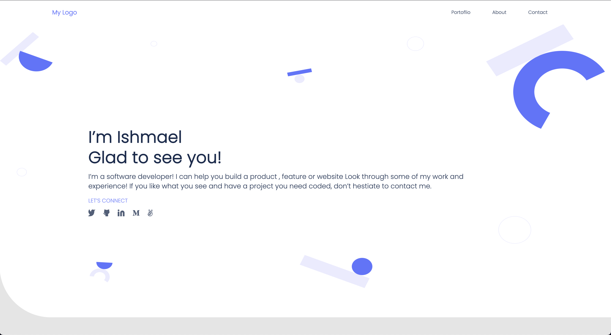

# Portfolio

> This project is a Microverse exercise on HTML & CSS that demonstrates the knowledge of Semantic HTML, flexbox, background properties, and mobile-first responsiveness, Responsive web design, CSS media query.

## Built With

- HTML
- CSS
- Figma
- Node
- Linters(Lighthouse, Webhint, Stylelint)
- VS Code
- Wave

## Live Demo

[Live Demo Link](https://ishmaelkargbo.github.io/portfolio)

## Getting Started

To get a local copy up and running follow these simple example steps.

### Prerequisites
- You need to have current Node version installed.

### Setup
- Copy or download the zip file if you want to use my template.

### Install
- Install npm

### Usage
- Delete the personal informations and fill them with yours.

### Run tests
- Run linters to be sure everything set up properly.

## Authors

👤 **Ishmael Kargbo**

- GitHub: [@githubhandle](https://github.com/ishmaelkargbo)
- Twitter: [@twitterhandle](https://twitter.com/ishoKargbo)
- LinkedIn: [LinkedIn](https://linkedin.com/in/ishmael-kargbo-9a986a214)

👤 **Dinma-Faith**

- GitHub: [@githubhandle](https://github.com/Dinma-Faith)
- Twitter: [@twitterhandle](https://twitter.com/paul_dinma)
- LinkedIn: [LinkedIn](https://linkedin.com/in/chidinma-faith)

## 🤝 Contributing

Contributions, issues, and feature requests are welcome!

Feel free to check the [issues page](../../issues/).

## Show your support

Give a ⭐️ if you like this project!

## Acknowledgments

- Hat tip to anyone whose code was used
- Inspiration
- etc

## 📝 License

This project is [MIT](./MIT.md) licensed.
